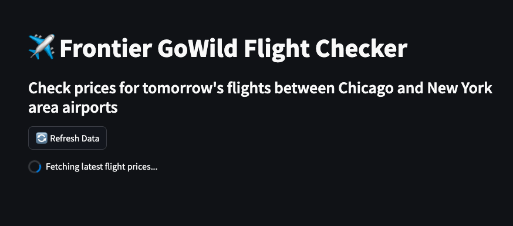

# Frontier GoWild Flight Checker 🛫

A Streamlit web application that checks and displays flight prices between Chicago and New York area airports for Frontier Airlines' GoWild pass holders.

## Features

- Real-time flight price checking
- Interactive filters for origin and destination airports
- Price comparison visualization
- Quick statistics (lowest price, average price, total flights)
- Auto-refresh capability
- Responsive design

## Supported Airports

### Chicago Area
- ORD (Chicago O'Hare International Airport)
- MDW (Chicago Midway International Airport)

### New York Area
- JFK (John F. Kennedy International Airport)
- EWR (Newark Liberty International Airport)
- ISP (Long Island MacArthur Airport)

## Project Structure

- `app.py`: Main Streamlit application
- `scraper.py`: Flight data scraper for Frontier Airlines
- `utils.py`: Utility functions and airport data
- `pyproject.toml`: Project dependencies

## Dependencies

- Python 3.11+
- beautifulsoup4
- pandas
- plotly
- requests
- streamlit
- trafilatura

## Usage

1. Click the "Run" button in the Replit interface
2. Wait for the application to start and load initial flight data
3. Use the filters to select specific airports
4. Click the "Refresh Data" button to get the latest prices
5. Sort flights by price, departure time, or arrival time
6. View the price comparison chart and statistics

## Notes

- Flight data is scraped from Frontier Airlines' website
- Prices and availability are subject to change
- The tool checks flights for the next day only
- Data is cached in the session state to minimize API calls

## Limitations

- Only supports specific airport pairs
- Updates require manual refresh
- Subject to website structure changes
- Rate limiting may affect data retrieval

## Legal Note

This tool is for informational purposes only. Users should verify prices and availability on Frontier Airlines' official website.
